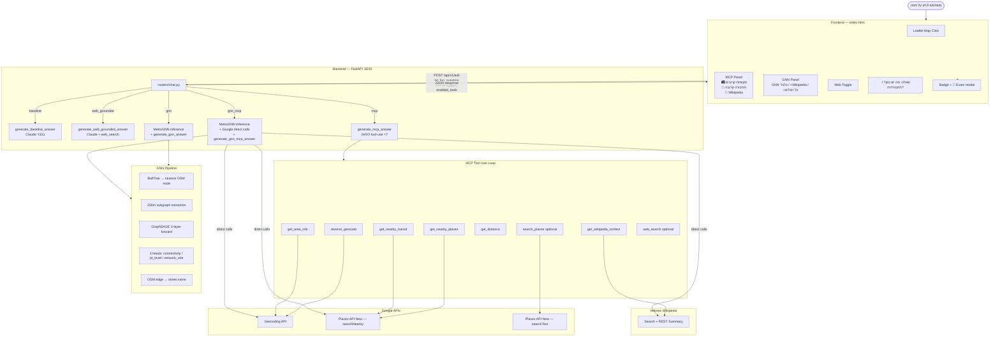
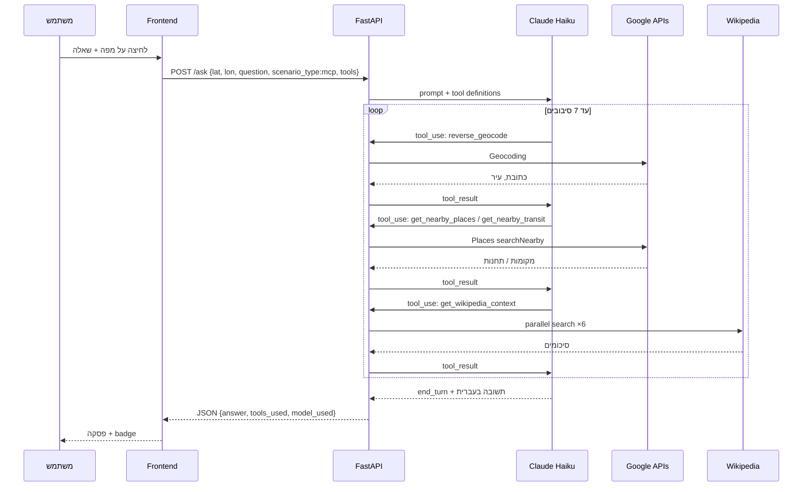
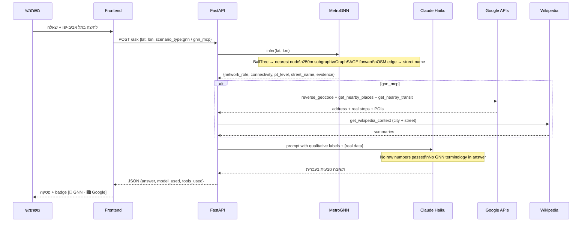
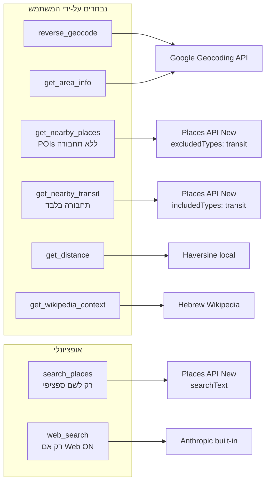
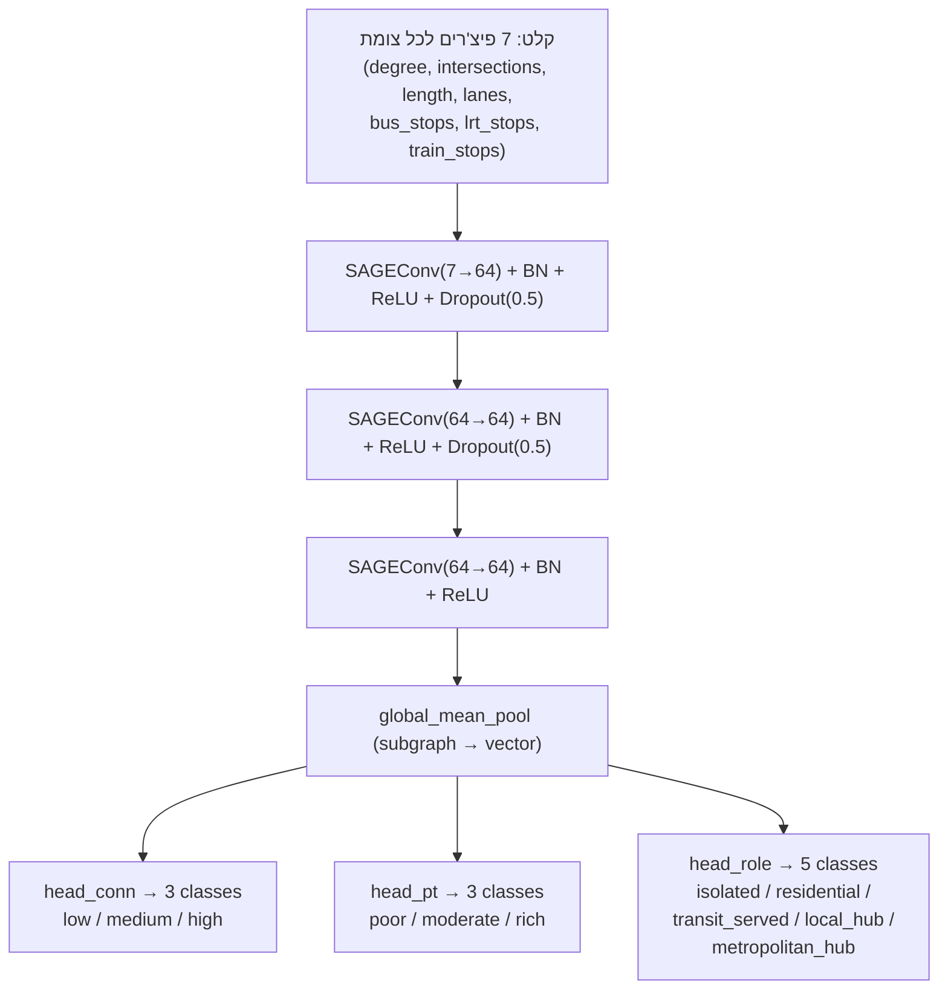

# Map Chat — Flow Diagram

```mermaid
flowchart TD
    User([משתמש לוחץ על מפה]) --> Frontend

    subgraph Frontend["Frontend — index.html"]
        F1[Leaflet Map Click]
        F2[MCP Panel\n🏙️ מקומות קרובים\n🚌 תחבורה קרובה\n📖 Wikipedia]
        F3[GNN Panel\nGNN בלבד / +Wikipedia / +כל הכלים]
        F4[Web Toggle]
        F5[שאלה: מה יש כאן? / תחבורתית?]
        F6[Badge + 🧪 Exam modal]
    end

    Frontend -->|POST /api/v1/ask\nlat, lon, question\nscenario_type, enabled_tools| Router

    subgraph Backend["Backend — FastAPI :8010"]
        Router[routers/chat.py]
        Router -->|baseline| Baseline[generate_baseline_answer\nClaude בלבד]
        Router -->|web_grounded| WebGrounded[generate_web_grounded_answer\nClaude + web_search]
        Router -->|mcp| MCP[generate_mcp_answer\nלולאת tool-use ×7]
        Router -->|gnn| GNN[MetroGNN inference\n+ generate_gnn_answer]
        Router -->|gnn_mcp| GNNMCP[MetroGNN inference\n+ Google direct calls\n+ generate_gnn_mcp_answer]
    end

    subgraph MCPLoop["MCP Tool-Use Loop"]
        T1[reverse_geocode]
        T2[get_area_info]
        T3[get_nearby_places]
        T4[get_nearby_transit]
        T5[get_distance]
        T6[search_places optional]
        T7[get_wikipedia_context]
        T8[web_search optional]
    end

    subgraph GNNPipeline["GNN Pipeline"]
        G1[BallTree → nearest OSM node]
        G2[250m subgraph extraction]
        G3[GraphSAGE 3-layer forward]
        G4[3 heads: connectivity / pt_level / network_role]
        G5[OSM edge → street name]
    end

    subgraph GoogleAPIs["Google APIs"]
        GA1[Geocoding API]
        GA2[Places API New — searchNearby]
        GA3[Places API New — searchText]
    end

    subgraph WikiAPI["Hebrew Wikipedia"]
        W1[Search + REST Summary]
    end

    MCP --> MCPLoop
    T1 & T2 --> GA1
    T3 & T4 --> GA2
    T6 --> GA3
    T7 --> W1

    GNN --> GNNPipeline
    GNNMCP --> GNNPipeline
    GNNMCP -->|direct calls| GA1 & GA2 & W1

    Router -->|JSON response| Frontend
    Frontend --> F6
```

---

## תרשים רצף — בקשת MCP

```mermaid
sequenceDiagram
    participant U as משתמש
    participant FE as Frontend
    participant API as FastAPI
    participant C as Claude Haiku
    participant G as Google APIs
    participant W as Wikipedia

    U->>FE: לחיצה על מפה + שאלה
    FE->>API: POST /ask {lat, lon, question, scenario_type:mcp, tools}
    API->>C: prompt + tool definitions

    loop עד 7 סיבובים
        C->>API: tool_use: reverse_geocode
        API->>G: Geocoding
        G-->>API: כתובת, עיר
        API->>C: tool_result

        C->>API: tool_use: get_nearby_places / get_nearby_transit
        API->>G: Places searchNearby
        G-->>API: מקומות / תחנות
        API->>C: tool_result

        C->>API: tool_use: get_wikipedia_context
        API->>W: parallel search ×6
        W-->>API: סיכומים
        API->>C: tool_result
    end

    C-->>API: end_turn + תשובה בעברית
    API-->>FE: JSON {answer, tools_used, model_used}
    FE-->>U: פסקה + badge
```

---

## תרשים רצף — בקשת GNN

```mermaid
sequenceDiagram
    participant U as משתמש
    participant FE as Frontend
    participant API as FastAPI
    participant GNN as MetroGNN
    participant C as Claude Haiku
    participant G as Google APIs
    participant W as Wikipedia

    U->>FE: לחיצה בתל אביב-יפו + שאלה
    FE->>API: POST /ask {lat, lon, scenario_type:gnn / gnn_mcp}

    API->>GNN: infer(lat, lon)
    Note over GNN: BallTree → nearest node\n250m subgraph\nGraphSAGE forward\nOSM edge → street name
    GNN-->>API: {network_role, connectivity, pt_level, street_name, evidence}

    alt gnn_mcp
        API->>G: reverse_geocode + get_nearby_places + get_nearby_transit
        G-->>API: address + real stops + POIs
        API->>W: get_wikipedia_context (city + street)
        W-->>API: summaries
    end

    API->>C: prompt with qualitative labels + [real data]
    Note over C: No raw numbers passed\nNo GNN terminology in answer
    C-->>API: תשובה טבעית בעברית

    API-->>FE: JSON {answer, model_used, tools_used}
    FE-->>U: פסקה + badge [🧠 GNN · 🏙️ Google]
```

---

## מבנה כלים MCP

```mermaid
graph LR
    subgraph Required["נבחרים על-ידי המשתמש"]
        R1[reverse_geocode]
        R2[get_area_info]
        R3[get_nearby_places\nPOIs ללא תחבורה]
        R4[get_nearby_transit\nתחבורה בלבד]
        R5[get_distance]
        R6[get_wikipedia_context]
    end

    subgraph Optional["אופציונלי"]
        O1[search_places\nרק לשם ספציפי]
        O2[web_search\nרק אם Web ON]
    end

    R1 & R2 --> GA[Google Geocoding API]
    R3 --> GP1[Places API New\nexcludedTypes: transit]
    R4 --> GP2[Places API New\nincludedTypes: transit]
    O1 --> GP3[Places API New\nsearchText]
    R5 --> HV[Haversine local]
    R6 --> WK[Hebrew Wikipedia]
    O2 --> ANT[Anthropic built-in]
```

---

## MetroGNN — ארכיטקטורה

```mermaid
graph TD
    Input["קלט: 7 פיצ'רים לכל צומת\n(degree, intersections, length, lanes,\nbus_stops, lrt_stops, train_stops)"]
    Input --> Conv1["SAGEConv(7→64) + BN + ReLU + Dropout(0.5)"]
    Conv1 --> Conv2["SAGEConv(64→64) + BN + ReLU + Dropout(0.5)"]
    Conv2 --> Conv3["SAGEConv(64→64) + BN + ReLU"]
    Conv3 --> Pool["global_mean_pool (subgraph → vector)"]
    Pool --> H1["head_conn → 3 classes\nlow / medium / high"]
    Pool --> H2["head_pt → 3 classes\npoor / moderate / rich"]
    Pool --> H3["head_role → 5 classes\nisolated / residential /\ntransit_served / local_hub /\nmetropolitan_hub"]
```
