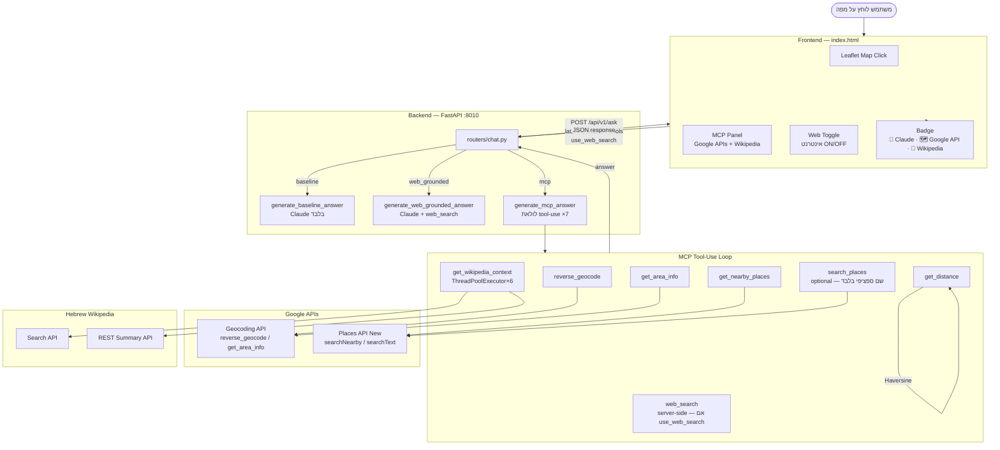
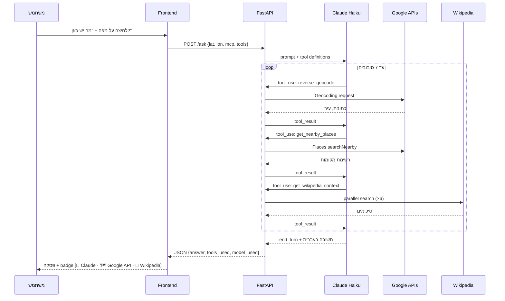
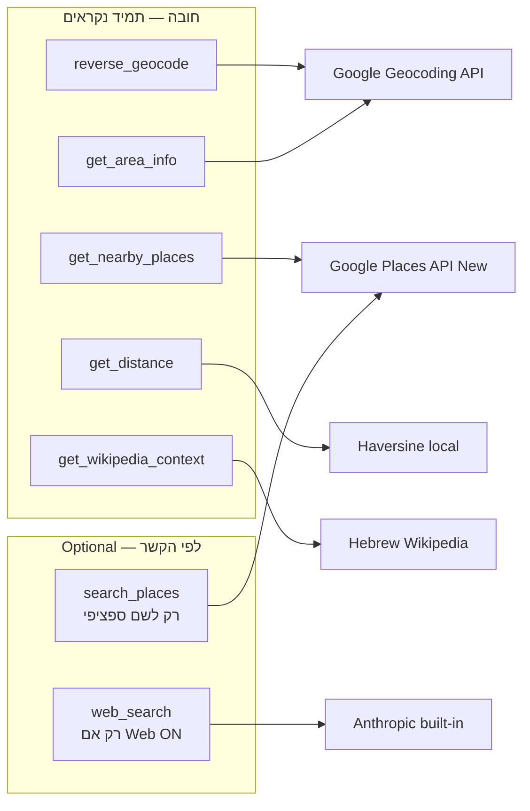

# Map Chat — Flow Diagram

```mermaid
flowchart TD
    User([משתמש לוחץ על מפה]) --> Frontend

    subgraph Frontend["Frontend — index.html"]
        F1[Leaflet Map Click]
        F2[MCP Panel\nGoogle APIs + Wikipedia]
        F3[Web Toggle\nאינטרנט ON/OFF]
        F4[Badge\n💬 Claude · 🗺️ Google API · 📖 Wikipedia]
    end

    Frontend -->|POST /api/v1/ask\nlat, lon, enabled_tools\nuse_web_search| Router

    subgraph Backend["Backend — FastAPI :8010"]
        Router[routers/chat.py]

        Router -->|baseline| Baseline[generate_baseline_answer\nClaude בלבד]
        Router -->|web_grounded| WebGrounded[generate_web_grounded_answer\nClaude + web_search]
        Router -->|mcp| MCP[generate_mcp_answer\nלולאת tool-use ×7]
    end

    subgraph MCPLoop["MCP Tool-Use Loop"]
        T1[reverse_geocode]
        T2[get_area_info]
        T3[get_nearby_places]
        T4[get_distance]
        T5[search_places\noptional — שם ספציפי בלבד]
        T6[get_wikipedia_context\nThreadPoolExecutor×6]
        T7[web_search\nserver-side — אם use_web_search]
    end

    MCP --> MCPLoop

    subgraph GoogleAPIs["Google APIs"]
        G1[Geocoding API\nreverse_geocode / get_area_info]
        G2[Places API New\nsearchNearby / searchText]
    end

    subgraph WikiAPI["Hebrew Wikipedia"]
        W1[Search API]
        W2[REST Summary API]
    end

    T1 --> G1
    T2 --> G1
    T3 --> G2
    T5 --> G2
    T4 -->|Haversine| T4
    T6 --> W1
    T6 --> W2

    MCPLoop -->|answer| Router
    Router -->|JSON response| Frontend
    Frontend --> F4
```

---

## תרשים רצף — בקשת MCP

```mermaid
sequenceDiagram
    participant U as משתמש
    participant FE as Frontend
    participant API as FastAPI
    participant C as Claude Haiku
    participant G as Google APIs
    participant W as Wikipedia

    U->>FE: לחיצה על מפה + "מה יש כאן?"
    FE->>API: POST /ask {lat, lon, mcp, tools}
    API->>C: prompt + tool definitions

    loop עד 7 סיבובים
        C->>API: tool_use: reverse_geocode
        API->>G: Geocoding request
        G-->>API: כתובת, עיר
        API->>C: tool_result

        C->>API: tool_use: get_nearby_places
        API->>G: Places searchNearby
        G-->>API: רשימת מקומות
        API->>C: tool_result

        C->>API: tool_use: get_wikipedia_context
        API->>W: parallel search (×6)
        W-->>API: סיכומים
        API->>C: tool_result
    end

    C-->>API: end_turn + תשובה בעברית
    API-->>FE: JSON {answer, tools_used, model_used}
    FE-->>U: פסקה + badge [💬 Claude · 🗺️ Google API · 📖 Wikipedia]
```

---

## מבנה כלים

```mermaid
graph LR
    subgraph Required["חובה — תמיד נקראים"]
        R1[reverse_geocode]
        R2[get_area_info]
        R3[get_nearby_places]
        R4[get_distance]
        R5[get_wikipedia_context]
    end

    subgraph Optional["Optional — לפי הקשר"]
        O1[search_places\nרק לשם ספציפי]
        O2[web_search\nרק אם Web ON]
    end

    R1 & R2 --> GA[Google Geocoding API]
    R3 & O1 --> GP[Google Places API New]
    R4 --> HV[Haversine local]
    R5 --> WK[Hebrew Wikipedia]
    O2 --> ANT[Anthropic built-in]
```