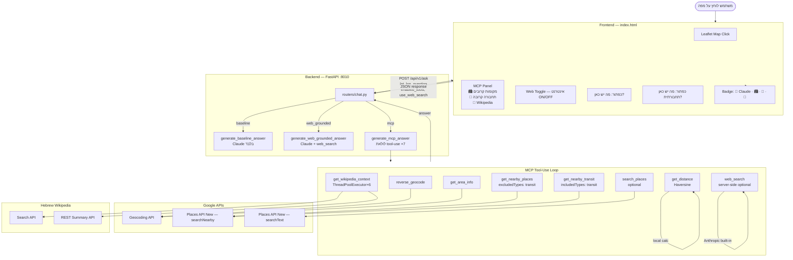
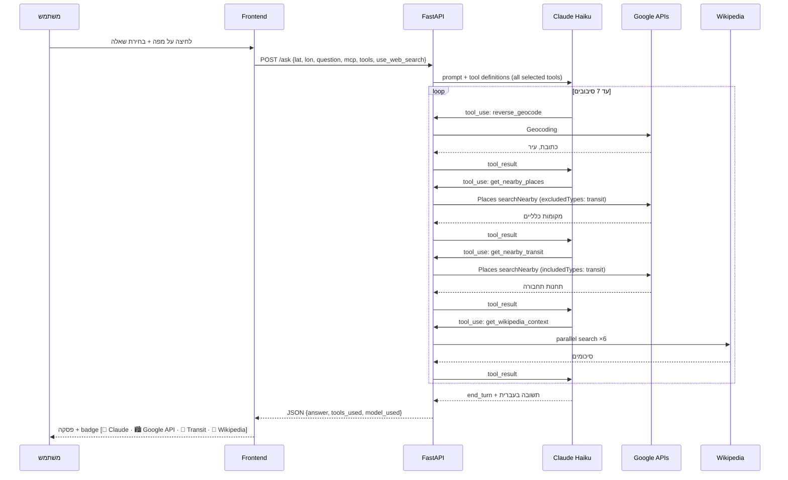
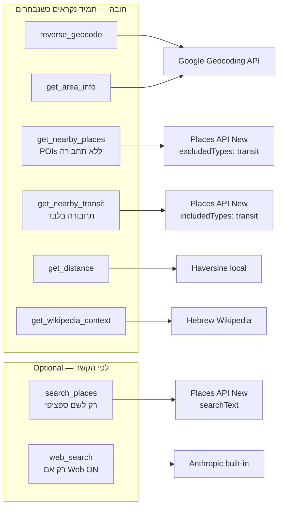

# Map Chat — Flow Diagram (Stage A Complete)

```mermaid
flowchart TD
    User([משתמש לוחץ על מפה]) --> Frontend

    subgraph Frontend["Frontend — index.html"]
        F1[Leaflet Map Click]
        F2[MCP Panel\n🏙️ מקומות קרובים\n🚌 תחבורה קרובה\n📖 Wikipedia]
        F3[Web Toggle — אינטרנט ON/OFF]
        F4[כפתור: מה יש כאן?]
        F5[כפתור: מה יש כאן תחבורתית?]
        F6[Badge: 💬 Claude · 🏙️ · 🚌 · 📖]
    end

    Frontend -->|POST /api/v1/ask\nlat, lon, question\nenabled_tools, use_web_search| Router

    subgraph Backend["Backend — FastAPI :8010"]
        Router[routers/chat.py]
        Router -->|baseline| Baseline[generate_baseline_answer\nClaude בלבד]
        Router -->|web_grounded| WebGrounded[generate_web_grounded_answer\nClaude + web_search]
        Router -->|mcp| MCP[generate_mcp_answer\nלולאת tool-use ×7]
    end

    subgraph MCPLoop["MCP Tool-Use Loop"]
        T1[reverse_geocode]
        T2[get_area_info]
        T3[get_nearby_places\nexcludedTypes: transit]
        T4[get_nearby_transit\nincludedTypes: transit]
        T5[get_distance\nHaversine]
        T6[search_places\noptional]
        T7[get_wikipedia_context\nThreadPoolExecutor×6]
        T8[web_search\nserver-side optional]
    end

    MCP --> MCPLoop

    subgraph GoogleAPIs["Google APIs"]
        G1[Geocoding API]
        G2[Places API New — searchNearby]
        G3[Places API New — searchText]
    end

    subgraph WikiAPI["Hebrew Wikipedia"]
        W1[Search API]
        W2[REST Summary API]
    end

    T1 & T2 --> G1
    T3 & T4 --> G2
    T6 --> G3
    T5 -->|local calc| T5
    T7 --> W1 & W2
    T8 -->|Anthropic built-in| T8

    MCPLoop -->|answer| Router
    Router -->|JSON response| Frontend
    Frontend --> F6
```

---

## תרשים רצף — בקשת MCP

```mermaid
sequenceDiagram
    participant U as משתמש
    participant FE as Frontend
    participant API as FastAPI
    participant C as Claude Haiku
    participant G as Google APIs
    participant W as Wikipedia

    U->>FE: לחיצה על מפה + בחירת שאלה
    FE->>API: POST /ask {lat, lon, question, mcp, tools, use_web_search}
    API->>C: prompt + tool definitions (all selected tools)

    loop עד 7 סיבובים
        C->>API: tool_use: reverse_geocode
        API->>G: Geocoding
        G-->>API: כתובת, עיר
        API->>C: tool_result

        C->>API: tool_use: get_nearby_places
        API->>G: Places searchNearby (excludedTypes: transit)
        G-->>API: מקומות כלליים
        API->>C: tool_result

        C->>API: tool_use: get_nearby_transit
        API->>G: Places searchNearby (includedTypes: transit)
        G-->>API: תחנות תחבורה
        API->>C: tool_result

        C->>API: tool_use: get_wikipedia_context
        API->>W: parallel search ×6
        W-->>API: סיכומים
        API->>C: tool_result
    end

    C-->>API: end_turn + תשובה בעברית
    API-->>FE: JSON {answer, tools_used, model_used}
    FE-->>U: פסקה + badge [💬 Claude · 🏙️ Google API · 🚌 Transit · 📖 Wikipedia]
```

---

## מבנה כלים

```mermaid
graph LR
    subgraph Required["חובה — תמיד נקראים כשנבחרים"]
        R1[reverse_geocode]
        R2[get_area_info]
        R3[get_nearby_places\nPOIs ללא תחבורה]
        R4[get_nearby_transit\nתחבורה בלבד]
        R5[get_distance]
        R6[get_wikipedia_context]
    end

    subgraph Optional["Optional — לפי הקשר"]
        O1[search_places\nרק לשם ספציפי]
        O2[web_search\nרק אם Web ON]
    end

    R1 & R2 --> GA[Google Geocoding API]
    R3 --> GP1[Places API New\nexcludedTypes: transit]
    R4 --> GP2[Places API New\nincludedTypes: transit]
    O1 --> GP3[Places API New\nsearchText]
    R5 --> HV[Haversine local]
    R6 --> WK[Hebrew Wikipedia]
    O2 --> ANT[Anthropic built-in]
```