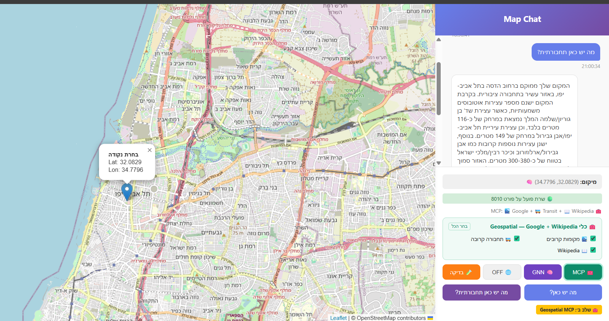
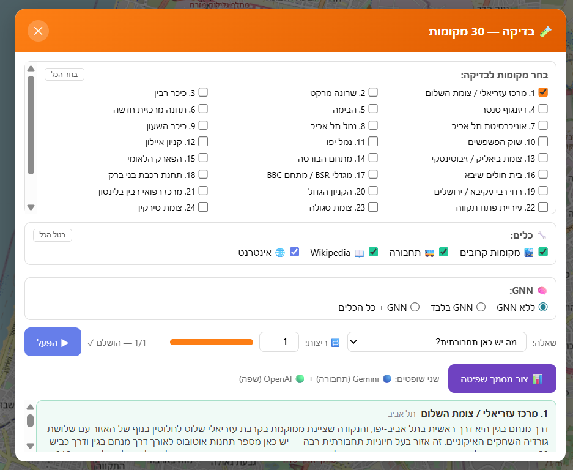

# Map Chat

A geospatial question-answering system. Click any point on a Leaflet map and receive a natural Hebrew paragraph describing the location — powered by Claude, Google APIs, Hebrew Wikipedia, and a Graph Neural Network trained on Tel Aviv's road and transit network.

---

## Screenshots

**Main interface** — click a map point, select a scenario, ask a question:



**Exam modal** — run batch evaluation over 30 fixed locations across Gush Dan:



---

## Architecture

```
frontend/index.html               backend/app/
  Leaflet.js map      ->  POST /api/v1/ask       ->  routers/chat.py
  MCP panel           <-  JSON response          <-  llm_service.py
  GNN panel                                           (tool-use loop x7 / direct calls)
  Web toggle                                     geo_tools.py      gnn_service.py
  2 question buttons                              |        |             |
  Badge display                            Google APIs  Wikipedia   MetroGNN model
  Exam modal          ->  POST /api/v1/exam/*  ->  routers/exam.py
                                                      |              |
                                               Gemini (judge)   OpenAI (judge)
```

---

## Operation Modes

| Mode | scenario_type | What happens |
|------|--------------|--------------|
| Baseline | `baseline` | Claude general knowledge only |
| Web | `web_grounded` | Claude + built-in web_search tool |
| MCP | `mcp` | Claude + Geo/Wikipedia tools (tool-use loop up to 7 rounds) |
| GNN | `gnn` | MetroGNN inference -> Claude formats output |
| GNN + Wikipedia | `gnn` + `enabled_tools: [get_wikipedia_context]` | GNN + OSM street name -> Wikipedia lookup |
| GNN + All Tools | `gnn_mcp` | GNN inference + Google Places + Transit + Wikipedia -> Claude |

---

## MCP Tools

| Tool | API | Description |
|------|-----|-------------|
| `reverse_geocode` | Google Geocoding API | Coordinates -> street address + city |
| `get_area_info` | Google Geocoding API | Address + one-line area summary |
| `get_nearby_places` | Google Places API (New) | General POIs, transit excluded |
| `get_nearby_transit` | Google Places API (New) | Transit stops and stations only |
| `get_distance` | Haversine (local) | Straight-line distance between two points |
| `search_places` | Google Places API (New) | Search for a specific named place |
| `get_wikipedia_context` | Hebrew Wikipedia REST + Search | City, street, and landmark summaries |

---

## GNN — MetroGNN

A GraphSAGE model (3 layers + BatchNorm, hidden_dim=64) trained on Tel Aviv-Yafo's OSM road graph and Israel GTFS transit data.

**Trained area:** lat 31.99-32.16, lon 34.73-34.87 (Tel Aviv-Yafo only)

**Input features (7):** degree, major intersections, road length, bus stops, light rail stops, train stations, unique GTFS routes (log1p normalized, spatial train/val/test split 70/15/15)

**Output heads (3):**

| Head | Classes |
|------|---------|
| connectivity_level | low / medium / high |
| public_transport_level | poor / moderate / rich |
| network_role | isolated / residential / transit_served / local_hub / metropolitan_hub |

**GNN inference flow:**
```
lat, lon
  -> nearest OSM node (BallTree haversine)
  -> 250m subgraph extraction
  -> MetroGNN inference (3 heads)
  -> qualitative labels + street name from OSM edges
  -> Claude writes natural Hebrew paragraph
```

**Model weights:** `אימון GNN/outputs/metro_gnn_best.pt` (18,571 parameters, ~300KB)

**Training data** is not included in this repository (1.2GB). To retrain, run `אימון GNN/gnn_train.ipynb` and provide:
- `אימון GNN/data/osm_road.graphml` — download via osmnx
- `אימון GNN/data/israel-public-transportation/` — Israel GTFS feed

---

## Exam / Evaluation

The exam modal runs batch evaluation over 30 fixed locations across Gush Dan (`exam/Places.csv`).

**Locations covered:** Tel Aviv (11), Jaffa (3), Ramat Gan (4), Bnei Brak (3), Petah Tikva (4), Holon (3), Bat Yam (1), Ra'anana (1), Kfar Saba (1).

**Running the exam:**
1. Click "Bdiqa" (exam button) in the frontend
2. Select locations (or "Select All")
3. Choose tools (MCP checkboxes) and/or GNN mode
4. Set number of runs (for noise analysis)
5. Click "Hpel" (run)
6. Optionally click "Generate Judging Report" to invoke LLM judges

**Judging:**

| Judge | Model | Evaluates |
|-------|-------|-----------|
| Gemini | gemini-2.5-flash | Transportation factuality, geographic grounding, hallucinations |
| OpenAI | gpt-4o-mini | Hebrew clarity, conciseness, relevance, usefulness |

**Score formula:**
```
FinalScore = 0.7 x TransportScore (Gemini /100) + 0.3 x LanguageScore (OpenAI /100)
```

Reports are saved to `evaluation/report_YYYYMMDD_HHMMSS.html`.

---

## Running Locally

**Prerequisites:** Python 3.10+, pip

**1. Clone and install dependencies:**
```bash
git clone <repo-url>
cd map-chat

cd backend
pip install -r requirements.txt
```

**2. Configure environment variables:**
```bash
cp backend/.env.example backend/.env
# Edit backend/.env and fill in your API keys
```

**3. Start the backend (port 8010):**
```bash
cd backend
uvicorn app.main:app --reload --port 8010
```

**4. Start the frontend (port 8001):**
```bash
cd frontend
python -m http.server 8001
```

**5. Open the app:** http://localhost:8001

In VSCode: `Ctrl+Shift+B` runs both servers via the configured build task.

---

## Environment Variables

Copy `backend/.env.example` to `backend/.env` and fill in:

```env
ANTHROPIC_API_KEY=...        # Required for all scenarios
ANTHROPIC_MODEL=claude-haiku-4-5-20251001
GOOGLE_API_KEY=...           # Required for MCP and GNN+MCP scenarios

# Required only for exam judging report
OPENAI_API_KEY=...
GEMINI_API_KEY=...

# Optional
GROQ_API_KEY=...
DATABASE_URL=sqlite:///./map_chat.db
```

Enable in Google Cloud Console: **Geocoding API** + **Places API (New)**

---

## Key Files

```
backend/
  app/
    routers/
      chat.py            POST /api/v1/ask — routes all scenario types
      exam.py            Exam endpoints + LLM judging + HTML report builder
    services/
      llm_service.py     Answer generators: baseline / web / mcp / gnn / gnn_mcp
      gnn_service.py     MetroGNN lazy loader + inference (BallTree + subgraph)
      geo_tools.py       All MCP tools: TOOL_DEFINITIONS, TOOL_FUNCTIONS
    schemas.py           QueryCreate, QueryResponse
    config.py            Settings loaded from .env
  logs/
    llm_calls.log        Full request/response log (auto-created)

frontend/
  index.html             Leaflet map + chat panel + MCP panel + GNN panel + exam modal

אימון GNN/
  gnn_train.ipynb        Training notebook (GraphSAGE, spatial split, multi-task heads)
  outputs/
    metro_gnn_best.pt    Best model checkpoint (committed, ~300KB)
    training_summary.png Training curves and confusion matrices
    label_distribution.png Label distribution across the dataset

exam/
  Places.csv             30 test locations (INDEX, PLACE, city, X, Y)
```

---

## License

MIT — see [LICENSE](LICENSE)
